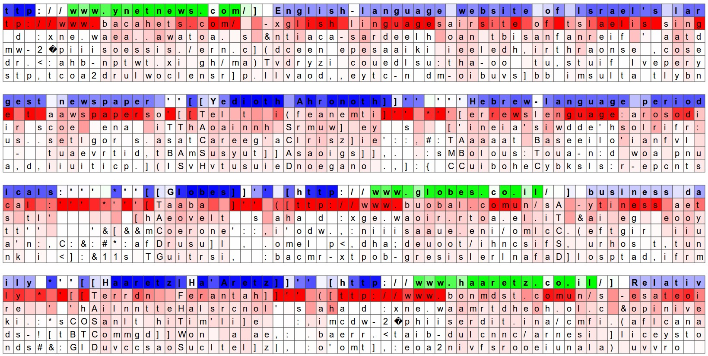

# Prefix

翻译自博客 :http://karpathy.github.io/2015/05/21/rnn-effectiveness/

what ,why ,how ,exmaples

# Reucrrent Neural Networks

下图给出了RNN的一些应用


*每个矩形是一个向量，箭头代表函数，红色矩阵代表输入，蓝色矩阵代表输出.从左到右(1)无RNN的情况下处理(2)序列输出(例如输入图像输出一些话)。(3)序列输入(例如情感分析)(4)序列输入序列输出(例如机器翻译任务)(5)同步序列输入输出(例如录像的分类，给每一帧打上一个标记)*


### Sequential processing in absence of sequences

把序列作为输入或者输出的情况可能很少，但是关键点就是要想到即使我们的输入输出是固定的，还是有可能去这种有用的形式以序列的方式来处理它们。例如下图是是一个算法学习一个RNN策略来驱使注意力在图像周围，下下图是一个RNN通过学习序列的添加颜色到canvas中来生成数字图像


### RNN computation

RNN的API简单，输入一个x向量，就能得到一个输出向量y。输出的向量还受之前整个输入的历史有关。Written as a class, the RNN’s API consists of a single `step` function:

```python
rnn = RNN()
y = rnn.step(x) # x is an input vector, y is the RNN's output vector
```

The RNN class has some internal state that it gets to update every time `step` is called. In the simplest case this state consists of a single *hidden* vector `h`. Here is an implementation of the step function in a Vanilla RNN:

意思是说RNN在每个step下有一些内部状态需要更新，最简单的情况下是包含一个隐藏层向量h

```python
class RNN:
  # ...
  def step(self, x):
    # update the hidden state
    self.h = np.tanh(np.dot(self.W_hh, self.h) + np.dot(self.W_xh, x))
    # compute the output vector
    y = np.dot(self.W_hy, self.h)
    return y
```

**这段代码就说明了矩阵之间的量级关系**

上面的代码是一个vaniliaRNN的前向传递过程。RNN有三个参数矩阵:W_hh,W_xh,W_hy.隐藏层self.h初始化为0。np.tanh为非线性把激活的范围压缩到[-1,1]。在tanh中有两项，一项是基于之前的隐藏状态，另一项是基于当前的输入。ht=tanh($W_{hh}$$h_{t−1}$+$W_{xh}$$x_t$).

用随机值初始化RNN的矩阵，在训练过程中都是寻找产生期望行为的矩阵，使用一个损失函数来表示更期望哪一种输出y，对应输入的序列x

### Going deep  

RNNs are neural networks and everything works monotonically better (if done right) if you put on your deep learning hat and start stacking models up like pancakes. For instance, we can form a 2-layer recurrent network as follows:(意思是说加入更多的deep learing东西会效果好)

```python
y1 = rnn1.step(x)
y = rnn2.step(y1)
```

### Getting fancy

LSTM,在计算隐藏层的时候麻烦一点


# Character-Level Language Models

我们已经知道了RNN的是啥，为啥这么好，以及怎么工作的。下面我们会给出一个具体的例子。例子的目标是:给RNN一堆文本并且要求给定之前字符的情况下，去建立序列中下一个字符的分布概率。这就允许我们生成下一个新的字符at a time

假定我们有4个可能的字符 helo，并且想让RNN训练一个"hello"。这个训练序列事实上是4个分离的训练样本:1.给定"h"的情况下下一个词应该是"e"。2.给定上下文"he"的情况下下一个字应该是"I".3.给定"hel"的情况下下一个词应该是l。4给定"hell"的情况下应该是"o"

具体来说，给每个字符进行1-of-k编码，然后输入step函数。那么我们将会观察到一个4维的输出向量(每个单词一个维度),这个向量我们解释为RNN当前对序列中接下来的每个字符的置信度。


*这是一个4维度的输出输入RNN，隐藏层为3个单元(理解为每个维度就是一个神经元输出)。这个图标展示了当我们给RNN输入hell时整个网络的激活状态。输出层包含RNN对每个字符(h,e,l,o)的置信度。我们想要绿色的数值变大，红色的数值变小*

例如，当神经网络第一次看到字符"h"时，RNN对下一个字符为"h"的置信度为1,"e"为2.2,"l"为-3,"o"为4,1.因为在我们的训练数据中(字符"hello")下一个正确的字符应该是"e"，所以我们想要提高"e"的置信度而降低其他的字符的置信度。同样的，我们对4个time step中的每一步都有一个希望网络赋值更高的置信度的期望的目标。因为RNN包含微分操作(意思是结构上是可微的？)我们就可以运行BP算法来指出我们每个参数的权值的调整方向来增加正确目标的分数(绿色加粗部分)。我们能够执行一个参数更新，在梯度方向改变一下权值。如果我们在参数更新完成后输入相同的数据就会发现正确的字符的分数会更高，并且不正确的字符的分数会更低。我们然后重复这个过程多次知道网络收敛并且网络的预测值最终和训练数据正确字符保持一致。

注意当我们输入第一个l时期望输出的是l，但是第二次期望输出就是o。因此RNN不能单单依赖于输入也要使用RNN的递归连接来跟踪上下文。

At **test time**, we feed a character into the RNN and get a distribution over what characters are likely to come next. We sample from this distribution, and feed it right back in to get the next letter. Repeat this process and you’re sampling text! Lets now train an RNN on different datasets and see what happens.(意思就是把输出的概率最高的词往下输入)

# Fun with RNNs

一堆用途

## 

## Generating Baby names

生成婴儿名

# Understanding what's going on 

展示了一下不同迭代次数以后的测试输出，模型先从粗到细开始学习。

## Visualizing the predictions and the "reuron " firings in the RNN



第一行是从验证集输入的一些字符，然后在下面5行是模型对下一个字符预测概率最高的头5个字符。颜色越深概率就越高。第一行的蓝色绿色表示RNN中隐藏层中选中的神经元的激活程度。绿色表示非常激动，蓝色表示不是特别激动

# Further Reading

哪天想看了再说


