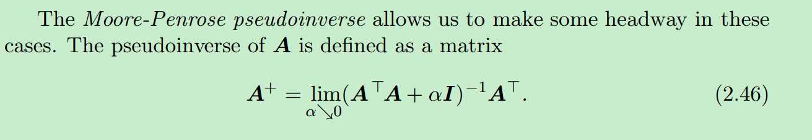
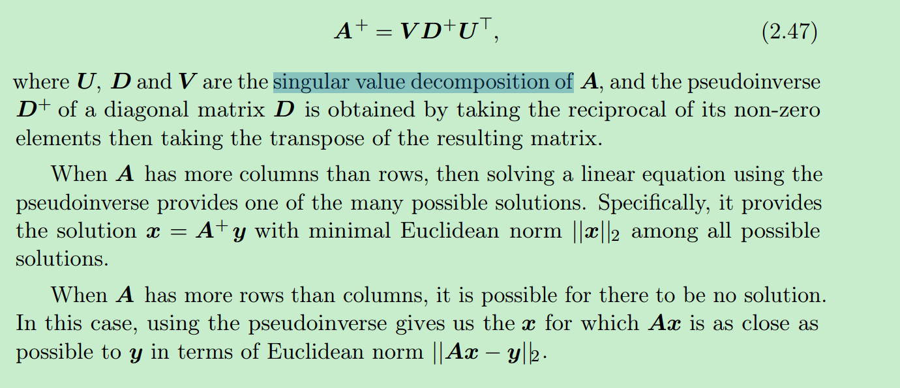
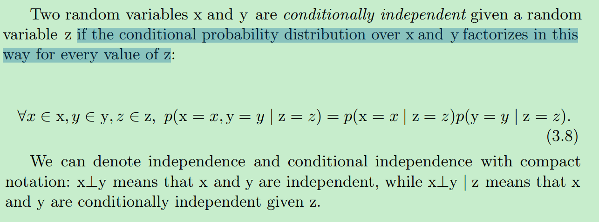
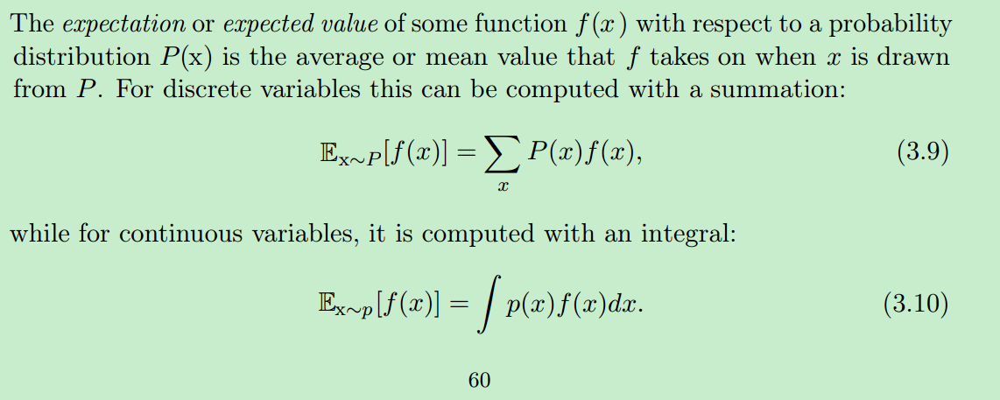
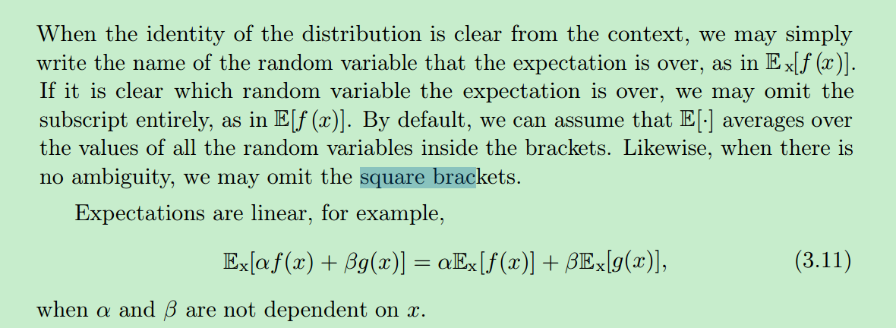

# 2.8 Singular Value Decomposition

for example, if a matrix is not square, the eigendecomposition is not defined, and we must use a singular
value decomposition instead 

We can actually interpret the singular value decomposition of A in terms of the eigendecomposition of functions of A. The left-singular vectors of A are the eigenvectors of AA. The right-singular vectors of A are the eigenvectors of A A.
The non-zero singular values of A are the square roots of the eigenvalues of A A. The same is true for AA  

# 2.9 The Moore-Penrose Pseudoinverse

# 2.10 The Trace Operator

The trace of as square martix composed of many factors is also invariant to moving the last factor into the first position.please see the book

# 2.11 The Determinant

The product is equal to the product of all the eigenvalues of the martix

# 2.12 Example :Principal Components Analysis

TODO:

# 3 Probability and Information Theory

First, the laws of probability tell us how AI systems should reason, so we design our algorithms to compute or approximate various expressions derived using probability theory. Second, we can use probability and statistics to theoretically analyze the behavior of proposed AI systems. (Design and analyze)

# 3.1 Why Probability

Bayesian probability and frequentist probability

# 3.3 Probability

## 3.3.1 Discrete Variables and Probability Mass Functions

# 3.9 Common Probability Distributions

