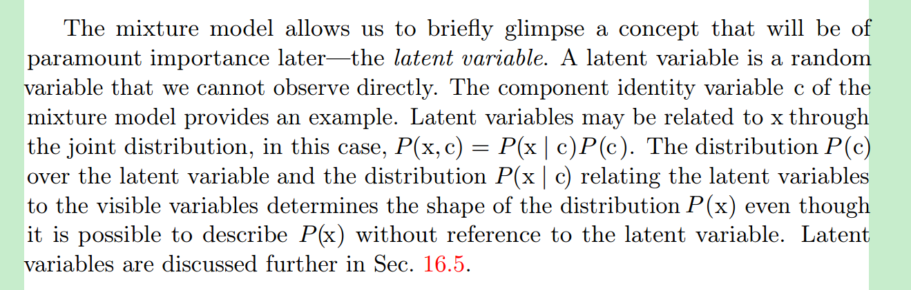
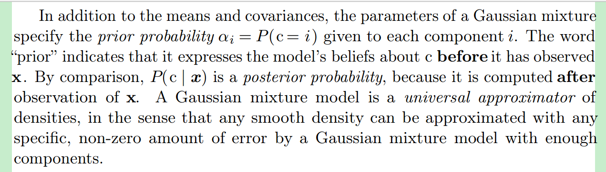
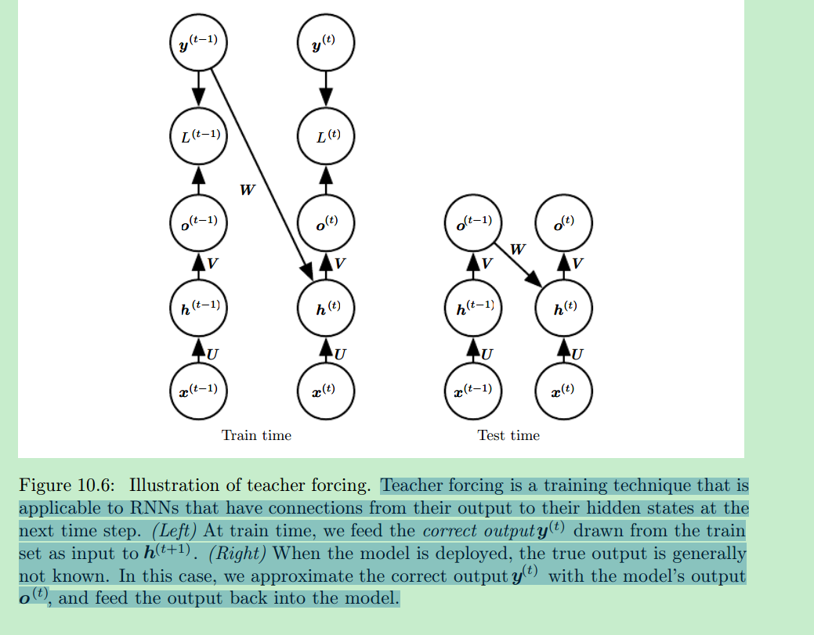

# 2.8 Singular Value Decomposition

for example, if a matrix is not square, the eigendecomposition is not defined, and we must use a singular
value decomposition instead 

We can actually interpret the singular value decomposition of A in terms of the eigendecomposition of functions of A. The left-singular vectors of A are the eigenvectors of AA. The right-singular vectors of A are the eigenvectors of A A.
The non-zero singular values of A are the square roots of the eigenvalues of A A. The same is true for AA  

# 2.9 The Moore-Penrose Pseudoinverse

# 2.10 The Trace Operator

The trace of as square martix composed of many factors is also invariant to moving the last factor into the first position.please see the book

# 2.11 The Determinant

The product is equal to the product of all the eigenvalues of the martix

# 2.12 Example :Principal Components Analysis

TODO:

# 3 Probability and Information Theory

First, the laws of probability tell us how AI systems should reason, so we design our algorithms to compute or approximate various expressions derived using probability theory. Second, we can use probability and statistics to theoretically analyze the behavior of proposed AI systems. (Design and analyze)

# 3.1 Why Probability

Bayesian probability and frequentist probability

# 3.3 Probability

## 3.3.1 Discrete Variables and Probability Mass Functions

# 3.9 Common Probability Distributions

## 3.9.6 Mixtures of Distributions

**Latent variables**

# 3.12 Technical Details of Continuous Variables

# 10 Sequence Modeling:Recurrent and Recursive Nets

The time step index need not literally refer to the passage of time in the real wordld, but only to the **position ** in the sequence. RNNs can also by applied in two dimensions across spatial data such as images, and even when applied to data involving time.

## 10.1 Unfolding Computational Graphs

$h_t = f(h_{t-1},x_t;$$\theta$)

To indicate that the state is the hidden units of the network .  using variable $h$ to represent the state. Typical RNNs will add extra architectural features such as output layers that read information out of the state $h$ to make predictions

We can view $h^t$ as a kind of lossy **summary **of the task-relevent aspects of the past sequence of inputs up to t , sine it maps an arbitrary length sequence ($x^t$,$x^{t-1}$,....) to a fixed length vector $h^t$ . For example , we ask $h^t$ to be rich enough when we want to predict the rest of the sentence.

The unfolding process thus introduces two major advantages:

- Regardless of the sequence length . 
- it is possible to use the same transition function f with the same parameters at every time step.

Learning a single ,shared model allows **generalization** to sequence lengths that did not appear in the traning set, and allows the model to be estimated with far fewer training examples than would be required without parameter sharing.

**powerful but also expensive to train**

## 10.2 Teacher Forcing and Networks with Output Recurrence

The network lacks hidden-to-hidden recurrence **requires that the output units capture all of of the information about the past that the network will use to predict the future**. Because the output units are explicitly trained to match the training set targets ,they are unlikely to capture the necessary information to match the training set targets, they are unlikely to capture the necessary information about the past history of the input, unless the user knows how to discribe the full state of the system and provides it as part of training set targets.

As soon as the hidden units become a function of earlier time steps,the BPTT algorithm is necessary. Some models may thus be trained with both teacher forcing and BPTT.

You can randomly select the output of model or the actual data values as input.

## 10.2.2 Computing the Gradient in a Recurrent Neural Network

# CS241:note3

## 1.4 Maximum Margin Object Function

sometimes we want true score to be higher and false score to be lower.Thus we design a object function to maximize ($s$ - $s_c$) ,where s is true label and $s_c$ is false label .   Thus, our optimization objective is now:
$$
maximiz( s - s_c ,0 )
$$
However, the above optimization objective is risky in the sense that it does not attempt to **create a margin of safety** .  We would want the "true" labeled data point to score higher than the "false" labeled data point by some positive margin $\nabla$. In other words, we would want error to be calculated if (s − $s_c$ < $\nabla$) and not just when (s − $s_c$ < 0). Thus, we modify the optimization objective:
$$
minimize  \ J =max(\nabla + s - s_c ,0 )
$$
The max-margin objective function is most commonly associated with Support Vector Machines(SVMs)

##  1.5 Training with Backpropagation-Elemental

- [ ] do a experiment with BP

## 2 Tips and tricks

### 2.1 Gradient Check
Here we introduce a technique of approximating the gradient without the use of error backpropagation.
$$
f^{'}(\theta) \approx   \frac {J(\theta^{i+}) - J(\theta^{i-}) } {2\epsilon}
$$
where $\theta^{i+} = \theta+\epsilon \star e_i $

### 2.4 Xavier Parameter Initialization

the paper Understanding the difficulty of training deep feedforward neural networks (2010). The empirical findings suggest that for sigmoid and tanh
activation units, lower error rates are achieved and faster convergence occurs when the weights of a matrix $W \sim R^{n^{(l+1)} \star n^{l}}$ are initialized randomly with a uniform distribution with the following range:
$$
W \sim[ -\sqrt{  \frac{6} {n^{l} + n^{l+1}}},\sqrt{  \frac{6} {n^{l} + n^{l+1}}}]
$$

###2.5 Learning rate

Faster convergence is not guaranteed with larger learning rate.In fact ,with very large learning rate ,we might experience that the loss function actually diverges because the parameters update causes the models to overshot the convex minima.

- RONAN Collobert scales the learning rate of weight $W_{ij}$ by the inverse square root of the fan-in of the neuraon.
- allow the learning rate to decrease over time 

### 2.6 Subgradient Optimization Using AdaGrad

AdaGrad is an implementation of standard stochastic gradient descent (SGD) with one key difference: the learning rate can vary for each parameter. **Parameters that have not been updated much in the past are likelier to have higher learning rates**

# CS241:note4

## 1 Language Models

talks about n-grams models

## 2 Recurrent Neural Networks(RNN)

$$
h_t = \sigma(W^{hh}h_{t-1}+W^{hx}x_{[t]})
$$

$$
\hat{y} = softmax(W^{S}h_t)
$$

[^footnote1 ]: photo to see the pdf note4:pag 3
[^footnote2]: $h_{t}$ output of the non-linear function at the previous time-step
[^footnote3]: $c_t$output before activation function

Let J denote the sum loss of T time-steps,the  Perplexity can be defined as 
$$
 Perplexity  = 2^J
$$

### 2.1 Vanishing Gradient & Gradient Explosion Problems

Consider two  Equations  in 2 , to compute the RNN error ,dE/dW,we sum the error at each time-step. That is ,$dE_t/dW$ for every time-step, t, is computed and accumulated
$$
\frac{\partial E}{\partial W} = \sum_{t=1}^{T} \frac{\partial E_t}{\partial W}
$$
By using chain rule differentiation to Equations,we can get 
$$
\frac{\partial E_t}{\partial W} = \sum_{k=1}^{t} \frac{\partial E_t}{\partial y_t}\frac{\partial y_t}{\partial h_t}\frac{\partial h_t}{\partial h_k}\frac{\partial h_k}{\partial W}
$$
This means, if we want to get the differentiation at time step t, the  **previous k time-steps all contributes to the loss at time-step t**.
$$
\frac{\partial h_t}{\partial h_k} 
= \prod_{j=k+1}^{t} \frac{\partial h_t}{\partial h_{j-1}} 
= \prod_{j=k+1}^{t} \frac{\partial h_t}{\partial (W^{hh}h_{t-1}+W^{hx}x_{[t]})} \frac{\partial W^{hh}h_{t-1}+W^{hx}x_{[t]}} {\partial h_{j-1}} 
=  \prod_{j=k+1}^{t} W^T diag[f^{'}(z_{j-1})]
$$
where  the form of $ \frac{\partial h_t}{\partial (W^{hh}h_{t-1}+W^{hx}x_{[t]})}$  is just like the vector  to vector differentiation,so the result is a matrix , just like followings 
$$
\frac{\partial h_t}{\partial h_{j-1}} = [ \frac{\partial h_t}{\partial h_{j-1,1}} \cdots  \frac{\partial h_t}{\partial h_{j-1,{D_n}}}]=
[\begin{matrix}  \frac{\partial h_{j,1}}{\partial h_{j-1,1}} ..... \frac{\partial h_{j.1}}{\partial h_{j-1,D_n}} \\ 
                             \frac{\partial h_{j,D_n}}{\partial h_{j-1,1}}...... \frac{\partial h_{j,D_n}}{\partial h_{j-1,D_n}}
\end{matrix}]
$$
and because $h_t = \sigma(z_t)$ ($z_t = W^{hh}h_{t-1}+W^{hx}x_{[t]}$) is element-wise, so  only  results on diagonal are not zero .

So we can get the followings:
$$
\frac{\partial E}{\partial W} =\sum_{t=1}^{T} \sum_{k=1}^{t} \frac{\partial E_t}{\partial y_t}\frac{\partial y_t}{\partial h_t}
( \prod_{j=k+1}^{t} \frac{\partial h_t}{\partial h_{j-1}} )\frac{\partial h_k}{\partial W}
$$

### 2.2 Solution to the Exploding & Vanishing Gradients

- exploding: clips gradient

- vanishing: 

  - let W start off from an identify matrix initialization

  - to use th Rectified Linear Units(ReLU) instead of the sigmoid function

### 2.3 Deep Bidirectional RNNs

### 2.4 Application:RNN translation Model

## 3 Gated Recurrent Units

