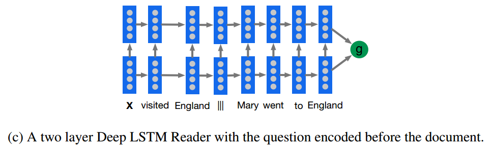
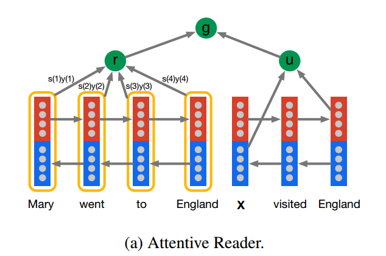
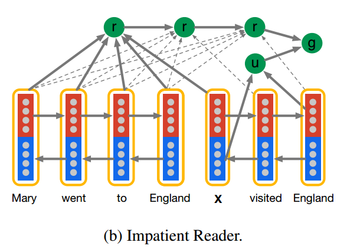

## memory network

## APPLYING DEEP LEARNING TO ANSWER SELECTION: A STUDY AND AN OPEN TASK

### abstract

此论文在不依赖任何语言工具的情况下，应用深度学习的方法来解决非事实问答任务，并且发布一个在保险领域的数据集。在测试集上数据最好能达到65.3%。

### 1 introduction

本文从文本搭配和选择的角度来解决QA问题，本文利用深度学习来完成对回答的选择。问题的定义:给定一个问问题q和回答候选{a1,a2,a3,.....as}，目标是在候选中找到最好的回答，如果选中的回答是真实答案中的子集，那么就认为问题被正确的回答了。从定义中，QA也可以被认为是一个二分类问题。

发布的数据集包含24981个不重复的问题

### 2 model description

接下来会给出一个深度学习框架，主要思想就是，学习一个给定问题和回答候选的分布向量表达，并且使用一个相似度量度来测量匹配程度。

#### 2.1 baseline system

- bag of words : 先用 "Distributed representations of words and phrases and their compositionality" 中提到的方法训练word embedding ，然后为问题和问题的候选答案的词向量产生idf权重之和, 这样就把问题和答案都向量化了。最后就是计算每个问题和候选对之间的cosine相似度，最高的就是答案。
- information retrieval :使用了目前最好的带权依赖模型 WD, WD模型使用基于术语和术语近似的排名特征来给每个候选回答打分。基本的思想是，在问题中重要的二元组或者三元组

## Teaching Machine to Read and Comprehend

有个问题，它是怎么训练的？是要最终的嵌入向量和答案响亮进可以相同？

### Abstract

2015年还缺乏大规模数据，本文给出一个大规模的数据集并且提出了一个新的方法来解决大数据集的瓶颈

### 1 Introduction

由于缺乏大数据，人工合成的数据很难转到实际对话中，因为难以capture自然语言中的复杂性以及噪声。

本文利用文章中的总结和文句，以及相关的文章，就构成了一个三元组。实验结果显示我们神经网络的方法要好的多。

### 2 Supervised training data for reading comprehension

#### 2.1 Entity replacement and permutation

在回答一些问题时，可以不看文章而直接利用自己的已有的知识就进行回答，例如 鱼的油能够帮助抵抗X？汤精能够帮助打败X吗？ngram 的语言模型能够在无视文件内容的情况下直接回答出 cancer因为这在数据集中是一个非常频繁的词。所以，我们对语料做如下处理

- 使用一个融合系统来建立各自的共同点数据点
- 根据共同出现的情况用抽象实体标记替代所有实体
- 每当加载数据点时，随机排列这些实体标记。

### 3 Models

两个baseline.一个是选择在文件中出现频率最高的实体,然而独占多数只会选择在文件中出现频率最高而不是查询中。

#### 3.1 Symbolic Matching Models

以下几个是传统的NLP方法模型

##### Frame-Semantic Parsing : 不懂

##### Word Distance Benchmark : 测量问题与和问题对齐的实体周围上下文的距离。这个方法可以一试

#### 3.2 Neural Network Models

提出了三个模型。把NLP中的问题看成是分类问题

##### The Deep LSTM Reader

先把文件按一个一个词输入到LSTM encoder中，在一个分割符后然后输入查询到encoder中。结果就是这个模型把文件和查询作为一个长句来处理。

使用了skip-connection,把每个输入x(t)连接到每一个隐藏层。

> 看上图，其实非常简单，就是用一个两层LSTM来encode query|||document或者document|||query，然后用得到的表示做分类。

##### The Attentive Reader

结合最近的ATTENTION 把隐藏层固定宽度的向量变成一个带权向量,然后文章一个向量，问题一个向量。

> 这个模型将document和query分开表示，其中query部分就是用了一个双向LSTM来encode，然后将两个方向上的last  hidden  state拼接作为query的表示，document这部分也是用一个双向的LSTM来encode，每个token的表示是用两个方向上的hidden state拼接而成，document的表示则是用 document中所有token的加权平均来表示，这里的权重就是attention，权重越大表示回答query时对应的token的越重要。然后用document和query的表示做分类。

##### The impatient Reader

> 这个模型在Attentive Reader模型的基础上更细了一步，即每个query token都与document 
> tokens有关联，而不是像之前的模型将整个query考虑为整体。感觉这个过程就好像是你读query中的每个token都需要找到document中对应相关的token。这个模型更加复杂一些，但效果不见得不好，从我们做阅读理解的实际体验来说，你不可能读问题中的每一个词之后，就去读一遍原文，这样效率太低了，而且原文很长的话，记忆的效果就不会很好了。

## Reading Wikipedia to Answer Open-Domain Questions

#### 3.1 Document Retriever

本文跟随传统的QA系统，使用一个非机器学习但是有效的文件检索系统来首先缩小我们的搜索空间并且关注于可能相关的几篇文章

####  3.2 Document Reader

方法类似在 Teaching Machine to Read and Comprehend里面的**AttentiveReader** ，可以试一试

##### Paragraph

先把段落p中的几个词 $p_i$ 表示为序列化的特征向量 $\hat p_i$ ,然后输入到RNN中得到对应的输出 $ \boldsymbol {p_i}$ ,这个输出认为是编码了在$p_i$ 有用的信息  ，本文中使用LSTM，并且把每层的隐层输出拼接成$ \boldsymbol {p_i}$ 。  $\hat p_i$ 由下面几个部分构成：

- 词嵌入
- Exact match:就是这个词是否在问题中出现过
- Token features: POS NER,TF
- aligned question embedding:词与问题中的每个词的相似度

##### Question encoding

编码问题更简单，因为我们只在qi的单词嵌入之上再应用另一个循环神经网络，将所得到的隐藏单元组合成一个单向量,这个向量也是每个词输出的带权之和

##### Prediction

在段落级别，目标是预测词的范围，把向量{$ \boldsymbol {p_1}$ ,$ \boldsymbol {p_2}$ ....$ \boldsymbol {p_m}$} 和问题$ \boldsymbol {q}$作为输入，简单的训练两个独立的分类器。具体使用双线性来捕获$ \boldsymbol {p_i}$和$ \boldsymbol {q}$ 的相似性并且计算每个词作为开始和结束的概率。关系如下式
$$
P_{start}(i)   \propto  exp ( p_i W_s q)
$$

$$
P_{end}(i)   \propto  exp ( p_i W_e q)
$$

## Character-Level Question Answering with Attention

### 1 Introduction

KB能够帮助单关系事实问答，但是自动的映射问题到KB查询中仍然是一个有挑战的任务，有三个主要的挑战

- 同一个问题里有很多个释义(paraphrases)
- 在训练时很多实体是没有训练到的，但是在测试时又要使用到，
- 类似于Freebase的KB包含了百万个实体和上千个谓词，使得系统很难在规模上预测这些实体

因此，本文提出一个字符级别的encoder和decoder框架

首先，使用一个LSTM encoder去对问题做embed。然后，为了让模型对于未见到的实体依然强健，我们从问题，谓词和实体的字符级别的表示(character presentation )中抽取embeddings。第三，为了拓展我们的模型来处理KB中上千和上万的实体和谓词，**我们使用一个通用的交互方程(a general interaction function)，在问题embeddings和KB embedding之间，这个方程能够度量他们的语义相关性来决定输出，而不是在decoder中使用一个大的output layer来直接预测实体**。 **字符级别的建模**和**语义相关函数**使得我们成功的产生最大似然分数对于没有出现在词汇表中的KB实体，这在标准的encoder和decoder框架中是一个挑战性的问题。

### 2 Related Work

我们主要由下面三个研究进行所激励:

- semantic-parsing   for   open domain   question   answering
- character-level language modeling
- encoder-decoder methods

在open-domain question answering中，语义分析(把一个问题翻译成一个结构化的KB查询)是一个KB问答系统中的关键部件。之前的方法是采用高质量的针对domain-specific databases的词典，最近的方法是建立一个语义分析框架。

对于大规模的KB，语义分析框架必须能够成功的在百万个实体和上千个谓词中找到对应的query。为了解决这个问题，最近的工作是对于在KB中的实体和谓词产生他们在文本描述中的embedding。然后应用一个general interaction function 来测量这些embedded KB实体对于问题的语义相关程度，然后决定最可能的KB query。

这些方法使用词级别的embedding然后可能会产生OOV的问题。因此,他们经常使用一个明显的数据增强使得每个遇到的词都有充足的例子

与词嵌入建模不同，虽然从前词级别的嵌入从没有在事实型问答中使用过，但它已经成功在应用在了信息检索，机器翻译，情感分析，分类和命令体识别中。而且，Chung et al(2015)正别 gated-feedback LSTMs 在关于词级别的嵌入时能够不或在语言建模中的长期依赖。

介绍了encoder,decoder.

我们把问答视为，**对于给定问题的KB query，与被embedded的KB 实体的解码**。整个系统都是端到端的。

### 3 Model

## Question Answer Using Deep Learning

### Abstract

本文中，使用几个深度学习方法来进行问题回答，主要侧重于bAbI 数据集

### 1 Introduction

QA在NLP中是一个精心研究的问题。尽管是最老的研究领域之一，QA能够应用在很多任务中，例如信息检索和实体抽取。最近，QA也被用来开发对话系统和聊天机器人来进行模拟的人类交流。传统上来讲，在这个领域的大多数研究使用传统基于语义的NLP技术，例如分词，词性标记和指代消解。很多目前效果最好的QA系统-例如，IBM Watson 使用的就是这些技术。

然而，最近在深度学习上的发展，神经网络模型已经展示了在QA上的一些突破。尽管这些系统通常涉及更小的学习流程，但是需要更大的训练量。GRU和LSTM允许RNNs针对QA处理更长的文本。更进一步的提升-例如注意力机制和记忆网络-允许网络去关注于最相关的事实。这些网络是当前深度学习QA中效果最好的。

本项目中，我们研究几个针对问答任务的深度学习模型。在描述两个基于RNN的基准模型后，我们会关注于端到端的记忆力网络，这个网络在一些QA任务中效果最好并且相对训练速度也很快

### 2 Data

在QA中有两类数据集，开放数据集和封闭数据集。在开放QA数据集中，答案依赖常识与在数据集中提供的任何文本。The Allen AI Science 和 Quiz Bow 数据集都是开放的QA数据集。在封闭数据集中，回答问题所需要的所有信息都已经在数据集中提供。The bAbI,CNN/Daily Mail 和MCTest数据集都是封闭QA数据集。

虽然开放QA数据集更加符合在现实中QA系统遇到的问题，这些数据集在除了QA系统之外还涉及大量的信息检索工程。因此，为了方便关注手头的任务，我们选择使用封闭数据集

**bAbI**是20个QA任务的集合，每个包含几个上下文-问题-回答的三元组，每个任务旨在测试推理中一个独特的方面，因此是测试QA学习模型的一个特定能力

**MCTest**

### 3 Approach

#### 3.1 基准模型

##### GRU:

使用GRU cell 来产生问题和故事中每句话的分布式表达，通过将故事中的每句话与问题拼接成一个向量，然后将这个拼接向量输入一个映射层，然后再经过softmax产生模型的最终输出。因此所有的答案都作为词编入了词汇表。

##### Sequence-to-sequence model:

GRU模型的一个缺点就是把答案认为是一个单词，然而，在bAbI任务8和19中，答案是以逗号分隔的列表，这就可能暗示s2s模型可能是有用的

S2S模型中，首先将故事输入RNN进行编码，然后输入一个特殊的问题开始的标记(Q),紧接着输入问题，然后，用一个特殊的符号GO告诉网络开始解码，解码器的初始状态为编码器的最后状态输出。解码器产生以STOP符号结尾的答案。

在训练过程中，解码器把正确答案接在GO符号后面输入，在验证和测试时，我们仅提供GO符号。在接下来的几步中，第t时刻解码器的输出会作为t+1时刻的解码器的输入。

我们使用s2s模型和用GloVe的词向量，对所有的任务一起进行了训练，然后单独测试。有趣的是，虽然这种方法相对其他的基准方法效果要差，但是在 yes/no的问题中做的相当好

#### 3.2 Dynamic memory networks

带有强监督的动态记忆网络能够在bAbI中大多数任务中达到目前最好的效果。我们使用了端到端的记忆力网络。

我们为bAbI建立的的网络有问题模块和输入模块。答案模块是一个简单的softmax层:我们早先

pass 因此作者也没做完实验

#### 3.3 End-to-end memory networks

端到端的记忆网络，是一个比动态记忆网络在输入特征映射和记忆泛化步骤上进行了简化的网络。这样的简化允许更快的训练和在项目中更大范围的实验。而且，端到端的网络在bAbI数据集上已经实现弱监督上最先进的性能。

##### 句子选择

端到端的记忆网络使用一个固定大小m的记忆，这个参数根据编码的句子数量决定。在bAbI任务中，每个故事中句子的数量各不相同，范围从2到228之间。因此，端对端记忆网络需要一个机制把故事的句子范围固定到一个不变的尺寸。

我们用0填充了句子数小于m的故事。对于那么句子数超过了m的故事，我们尝试了两个方法:*Recency*，故事中最后m个句子会被存入网络，之前的记忆会被简单的丢弃；*Jaccard similarity*，其中和问题最相似的m个句子会以在故事中出现的顺序存入记忆中。

然而，这些方法都是静态的，这意味着我们要在训练时通过学习查询相似度参数才能提升这些方法。

##### 输入表示

在故事通过填充或者Jaccard相似度方法转换为记忆的大小，模型的输入就变成了句子的集合x1,x2....xm与问题，每个句子用0填充到句子的最大长度J，所以每个xi是一个大小为 V × J 的矩阵，其中每列都是独热编码的向量。

为了将故事进行编码，我们使用一个低维的查找表矩阵 A 。因此Axi就是句子中词的低维表示。为了将这个表达转换为整个句子的表达，我们使用了位置编码。

位置编码使用位置编码权重与句子低维嵌入做元素相乘，使得低维嵌入中每一维的每一个词都有一个对应的权重。每个句子然后通过对句子中所有词的带权值求和和加上一个对应记忆单元时间顺序的偏置项，转换为一个记忆mi的插槽。与位置编码不同，时序编码的权重在训练过程中是可学习的。

问题编码向量使用一个不同的嵌入矩阵B和位置编码进行编码。然而，问题编码中不使用时序编码，因为它是一个向量，并不是时间顺序。

