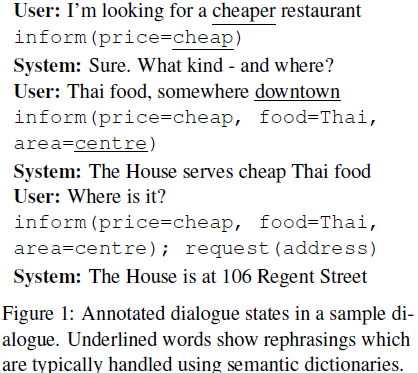
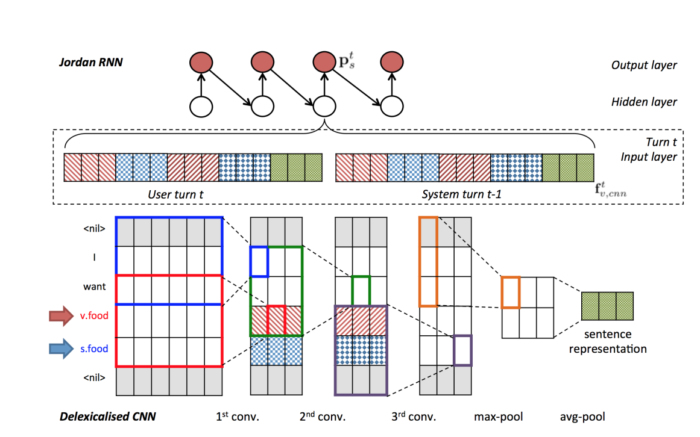
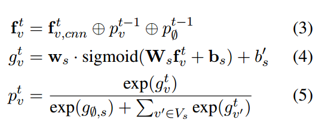
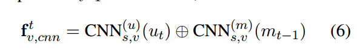

# Prefix

机器在理解一句话时，每个词的确切含义并不重要，重要的是这句话的意思。为了让机器能够处理，我们用语义表示来代表自然语言的意思。语义表示可以用意图+槽位的方式来描述。意图即这句话所表达的含义，槽位即表达这个意图所需要的具体参数，用slot和value对的方式表示。比如，「预约这周日上午的保洁阿姨」这句话的意图是「发起请求」，槽位是「服务类型=保洁，服务日期=20161127」。NLU(natural language understanding )要做的事情就是将自然语言转化成这种结构化的语义表示。

## 这篇论文的概要

任务：找餐馆 
数据：众标，标了680轮对话，共1500个turns，都是人工写的。db中有99家餐厅，可根据 口味/地点/价格（这三个叫informable slot） 查询餐厅， 选定餐厅后可查询 电话、邮编等其他6项（这6个叫requestable slot）信息。 
模型： 
① Intent network 根  informable slot的多元概率分布，和每个requestable slot的二项分布。用于在db中检索。 
③ Database Operator 数据库中根据 informable slot项检索， 返回一个vector，符合的entry记为1，其他为0，entity指针指向vector label为1中的一个餐厅（这个pointer到Generation Network中用到）。 
④ Policy Network 融合①，②，③中得到的vector，得到新的vector，表示当前状态 
⑤ Generation Network 用seq2seq的方法，根据④得到的vector 生成整句话，然后用③中pointer所指向的db中的那个entity替换句中的一些项。

[需要的前置知识](https://mi.eng.cam.ac.uk/~nm480/presentation-nbt.pdf)

Beliefs:a probability distribution over the available slot values (the belief state)for each slot in the ontology

置信度:在某个领域集和内各种属性对的概率分布

delexicalisation:意思是在一个表达中所有属性名或者属性值会被替换为generic tags例如

> I want Chinese food 
>
> I want cheap price range
>
> = I want VALUE SLOT

**domain ontology**：类似知识图谱里的本体，定义了要填的槽和可能取值的集合；

## 下面给一个belief tracking的小例子

# Abstract

通过和人类进行自然的谈话来教导机器去完成任务是很难的。目前，开发任务导向的对话系统要求创建多个元件并且这样会包含一大堆人的工作，或者要求昂贵的标记的数据来解决对于每个component的统计学习问题。本文提出了一个基于神经网络的 text in text out和end to end的可训练的目标导向的对话系统，以基于一个新的流水线的Wizard-of-Oz框架。这就使得我们能够简单的开发对话系统并且不需要太多的假设。结果显示模型能够和受试人自然的谈话同时帮助受试人在**饭店搜索**领域完成任务。

# Introduction

建立一个任务导向的对话系统例如旅店预定或者技术支持服务很难，难点在于是application-specific和可用的训练数据少。最近的机器学习方法把这个问题视为一个partially observable Markov Decision Process (POMDP) ，想用增强学习来在线的与user交互来得到训练。然而**语言理解** 和 **语言生成** 这两个模块还是依赖于监督学习，需要语料进行训练。因此为了让RL易于训练，state和action必须小心的设计，这样可能就限制了模型的表达和学习能力。并且训练需要的反馈函数也很难设计并且很难再运行时measure。(RL的三个难点)

在另一个范围。S2S的方法把对话看成a source to target 的序列转换任务，应用了编码网络来把用户的查询编码到一个分布的表示查询语义的向量，这个向量会依赖解码网络来生成每个系统回应。这些模型要求**大量的数据** ，能够产生有效的聊天型的机器人但是**缺乏支持domain specific的任务**的能力，例如与数据库交互，整合有用的信息到回应中去。(S2S的缺点)

本文通过平衡两个方法的优缺点来达到目的:模型是端到端可训练的但是仍然模块化连接;并不直接对用户目标建模，但是仍然通过在每个回合提供 *relevant* 和*approproate*的回应去学习完成要求的任务;拥有一个数据库属性(slot-value pairs)来达到high task success rate，但是也有一个用户意图的distributed representation(对话行为)来允许模糊的输入;它使用delexicalisation(意思是把词替换成一般的属性，这样就可以权值共享)和weight trying 策略来减少要求的训练数据数量，但是仍然保持一个高度的自由度如果能够拿到大量的数据(still maintains a high degree of freedom should larger amounts of data become available.  )这个系统在训练了几百次以后效果就很好。(本文的方法，两者结合)

为了训练这个模型，我们由Wizard-of-Oz激发提出了一个新的流水线数据收集过程，通过众包来收集human-human的对话语料。这个很好

# Model

把对话看成是一个增加了对话历史的序列到序列的map问题和当前数据库搜索的产生。每一个回合，系统从用户那得到一系列的tokens作为输入然后把它转换为两个 internal representations:一个由内部网络生成的distributed representation和叫做belief state的slot-value pairs的概率分布，通过belief trackers 生成。数据库操作然后会选择在置信状态中最可能的值来构成一个对数据库的请求，同时(along with)意图表示和置信状态会把搜索结果通过策略网络转化和结合在一起，构成一个向量表示下一个系统的行为。这个系统的行为向量然后会被用来当做一个回应生成网络(is then used to condition a response generation network )，这个网络会生成要求的系统输出token by token in skeletal form。最后系统的输出会通过替换数据库中实体的实际值到skeletal 句子结构中。(就是一个belief tracker 对属性值进行判断哪个概率最大，然后intent network貌似是判断是输入词的属性？，然后两个模块都交给策略网络，然后策略网络根据数据库中的值，填充并输出给生成网络)

## 2.1Intent Network

这个模块可以看成是一个S2S学习框架中的编码器，任务是去对输入的tokens编码到一个distributed vectio representation $z_t$在每个回合$t$ 时，典型的，使用LSTM并且最后的time step时的隐藏层输出$Z_t^N$ 最为表达，另外一种选择就是，使用CNN来代替LSTM作为编码器。因为特定的信息的属性值是delexicalised，编码向量能够被视为一个distributed intent  represention,这个编码替换了手工编码的对话行为表达(这个网络的作用就是当做编码器)

## 2.2Belief Trackers

**解释一下belief state是啥，**

Belief tracking(也叫作对话状态跟踪)是系统的核心。当前的belief trackers使用例如RNN这样的离散模型来直接映射ASR假设到belief states(to directly map ASR hypotheses to belief states).仍然使用belief tracking 作为系统核心的原因:

1. 能够使得形式自由的自然语言句子被映射到一个固定的slot-value pairs，这样就能被用来去对DB产生quiry.这个可以看成是一个语义的分词器
2. 通过跟踪对话状态，可以避免从原始输入中学习一些不必要的复杂的长期的依赖
3. uses a smart weight tring strategy that can greatly reduce the data required to train the model
4. it provides an inherent robustness which simplifies future extension to spoken systems 

belief tracker的任务就是获得针对每个informable属性的不同值的概率(就是说要该类别的那个值)，和每个requestable slot的binary 分布。在ontology图中的每个属性有自己的tracker，每个tracker是 Jordan类型的带有一个CNN的特征抽取的RNN(作用就是获得属性的值的概率分布？？？).我们将每个值v绑定RNN权重，但是在更新每个pre-softmax激活g时会改变特征f。对于输入的属性s，更新的等式如下所示

如下图2所示，$f_{v,cnn}^t$是两个CNN抽取的特征的拼接，一个来自t轮用户的输入另一个来自机器在t-1轮的反应$m_{t-1}$

(TODO:为啥用n-gram?不懂)

为了当delexicalisation应用于slot或者value时，使得tracker能够aware到，这个CNN操作不仅抽取顶层的句子表达，而且也会intermediate n-gram-like embeddings determined by the position of the delexicalised token in each utterance ，如果有很多matches，对应的embedding会加起来。另一方面，如果对于一个特定的slot或者value没有match，那么空的n-gram-like的embeddings会被设为0.为了跟踪delexicalised tokens的位置，在每次卷积操作前句子的两端都会被填为0，向量的数量由每层的filter决定。详情见图2

上面的belief tracker与 Henderson(2014)修改的地方在于:

1. 只有informable and requestable的slot和值的概率是输出的
2. recurrent memory block被移除了，因为它在这个任务中表现的不好
3. n-gram 的特征抽取被上文的CNN特征抽取代替

通过引入一个基于属性的belief trackers,与训练一个单纯的端到端系统相比我们本质上添加了一些中间标记。接下来会说明这些tracker元件对于实现任务的成功是多么重要。我们也会展示额外的标注要求能够成功迁移通过流水线Wizard-of-Oz数据收集框架

## 2.3 Policy NewWork and Database Operator

### Database Operator

  基于belief trackers的输出$p_{s'}^t$ ，DB查询操作由下式构成

公式(7)

其中$S_I$是informable slots的集和。这个请求然后会应用到DB中去创建DB实体的binary truth value 向量，其中1代表对应的实体和查询是一致的(因此和最可能的belief state是一致的)。另外，如何x不是全空的，一个关联的实体指针会maintained，这个指针会识别随机选择的匹配的实体。如果当前的实体不再匹配搜索标准，那么实体指针将会更新。(这里讲DB的请求以实体为变量产生一个二值的向量，指针拿来干嘛用？怎么更新？)

### Policy network

策略网络可以视为一个粘合剂把系统模块都绑到一起。它的输出是一个向量$o_t$代表系统的行为，并且输入是包含来自intent network的$z_t$ ，置信状态$P_S^t$ ，和DB真实值向量$X_t$。 生成网络仅生成合适的句子形式，在informable belief state中的类别值的个别概率是不重要的并且会加在一起来构成一个summary belief vector对于每个由三个元件构成的属性:the summed value probabilities, the probability that the user said they "don’t care" ,about this slot and the probability that the slot has
not been mentioned 。

## 2.4 Generation Network

生成网络使用行为向量$o_t$ 来调节语言生成。这就产生了像模板一样的由一个个token构成的句子，基于语言模型概率

公式 9

LSTM的一些操作，一旦输出的token序列生成了，类别token就会被替换为他们的实际值:

1. replacing delexicalised slots by random sampling from a list of surface forms, e.g. <s.food> to
   food or type of food,  
2. replacing delexicalised values by the actual attribute values of the entity currently selected by the DB pointer 

### Attentive Generation Network

讲了一下attention

# 3 Wizard-of-Oz Data Collection

对于给定的本体，我们设计了两个网页，一个是给wizard，另一个给用户。给用户的是确定特定实体的特点的任务，并且会被要求输入自然语言去完成任务。给wizards的是一个表格来记录上一个user传递的信息(例如pricerange=Chinese,area=north)并且一个搜索表格会展示在数据库中匹配到的所有实体。注意这些表格包含了训练基于属性的置信状态跟踪时需要的所有标记。在每次wizard提交新的信息时表格会自动的更新。基于更新的表格，wizard输入一个合适的系统回应并且对话会继续下去。

为了能够大规模并行收集并且避免对连续潜在状态的打断,user和wizards贝耀秋去在每个对话中仅贡献一轮。为了确保连续和一致性，user和wizards必须在贡献对话前review之前的turns。因此对话是一个流水线。尽管很多工人会对每个对话有贡献，但是我们观察到对话大致还是连续的。因此，这个回合制的数据收集策略看起来鼓励workers去学习并且基于之前的turns校正对方。

本文中，系统帮助用户找饭店，三个informable的属性，6个请求属性。在数据中有99个饭店，大致3天内运行3000个HIT，收集1500个对话，有效680个对话，花费400USD

# 4 Empirical Experiments

### Training 

