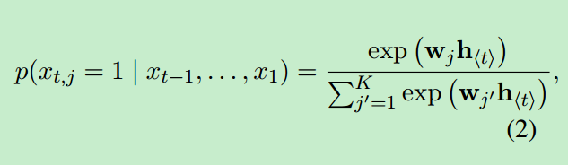
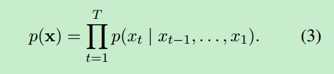

# Abstract

本文提出的模型包含两个RNN。一个RNN是作为编码机把输入的符号序列编码到一个固定长度的向量表示，另一个RNN是把该表示解码到另一些符号序列。联合训练编码与解码以最大化给定源序列时的目标序列的条件概率。此模型能够在语言短语上学习到句法与句意方面上有意义的表示。

# 1 Introduction

本文提出一种新的网络结构，能够作为传统基于词的翻译的一部分。说了下两个RNN的作用，同概要中，然后还提出一个sophisticated隐层单元来提升内存容量和训练的简单化。

量化分析显示这个模型更好的捕获在词汇表中的语义规则，不直接的解释了翻译任务上的整体表现的提升，进一步分析揭示了RNN编码解码学习到了continuous space representation of a phrase that preserves both the semantic and syntactic structure of the phrase 

# 2 RNN Encoder-Decoder

## 2.1 Preliminary:Recurrent Neural Networks

RNN是一个网络包含隐藏层状态h和可选的输出y，在一串可变长度的序列上x=($x_1$,$x_2$ ...,$x_T$) 。每一个时间步骤上t，隐藏状态$h_{<t>}$ 由下式更新

RNN能够对于每个训练的句子学习概率分布以预测序列中下一个符号。在此情况下，每步的输出 是一个条件概率。例如用softmax激活函数输出一个多项式分布概率(1 of K coding)

对于所有的符号j=1,...K,$w_j$是权值矩阵W的一行。通过结合这些概率，我们能使用下式去计算序列x的可能性。

从这个学习到的分布中，我们可以很直接的通过迭代的采样每个time step上的符号来sample new sequence(From this learned distribution, it is straightforward to sample a new sequence by iteratively sampling a symbol at each time step )

## 2.2 RNN Encoder-Decoder

从概率的角度来看，模型是一个通用模型，能够学习到依赖另一个序列的序列的概率分布。例如 p($y_1$,...$y_T$ |$x_1$,...$x_T$ ),**注意x和y两个序列的长度可以不一样** 

RNN的编码器序列读入输入序列x，在读入每个符号时，RNN的隐藏状态的改变由(1)式给出。在读完序列以后，**RNN的隐藏状态就是整个输入序列的总结$c$  。**

编码器的作用是，给定隐藏状态 $h_{<t>}$ ，通过预测下一个符号$y_t$来产生新的输出序列。然而和2.1节中的不同的是，$h_{<t>}$和$y_t$都一拉与 $y_{t-1}$和输入序列的总结$c$。因此在t时刻的编码器的隐藏层状态由下式计算

同样的，下一个符号的条件分布为

对于一个给定的激活函数$f$和$g$(后者必须产生合法的概率，例如softmax)

上图是模型的整体结构

提出的RNN编码与解码两个部分是联合训练来最大化条件log-likelihood

$\theta$是参数，每个($x_n$,$y_n$)是来自训练集的输入输出对，因为可微分所以使用梯度下降来更新参数

这个训练完成后的模型可以有两种方式。第一种是输入序列来产生新的序列，另一种是对输入输出序列进行打分，score可以是简单的来自3,4中的条件概率 $p_{\theta}$(y|x)

## 2.3 Hidden Unit that Adaptively Rmemembers and Forgets

本文提出了一个新的隐藏单元。下式计算一个 reset  gate $r_j$

$\delta$是一个logistic sigmoid函数，$[.]_j$中的第j的元素。x是输入,$h_{t-1}$是隐藏层，另外两个是参数矩阵

update gate $z_j$是下式计算

$h_j$的实际输出为

其中

当reset gate设置为0时代表hidden state会忽略之前的hidden state并且会reset with the current input only。这就有效的允许hidden state丢弃与未来无关的信息，因此会得到一个更加紧凑的表达

update gate用来控制之前的信息中有多少可以流入当前的hidden state

learn to capture 短期的 unit的forget gate会频繁的激活，而update gate是capture长期的信息,update gate会频繁的激活

# 3 Statistical Machine Translation

pass 

## 3.1 Scoring Phrase Pairs with RNN Encoder-Decoder

pass

